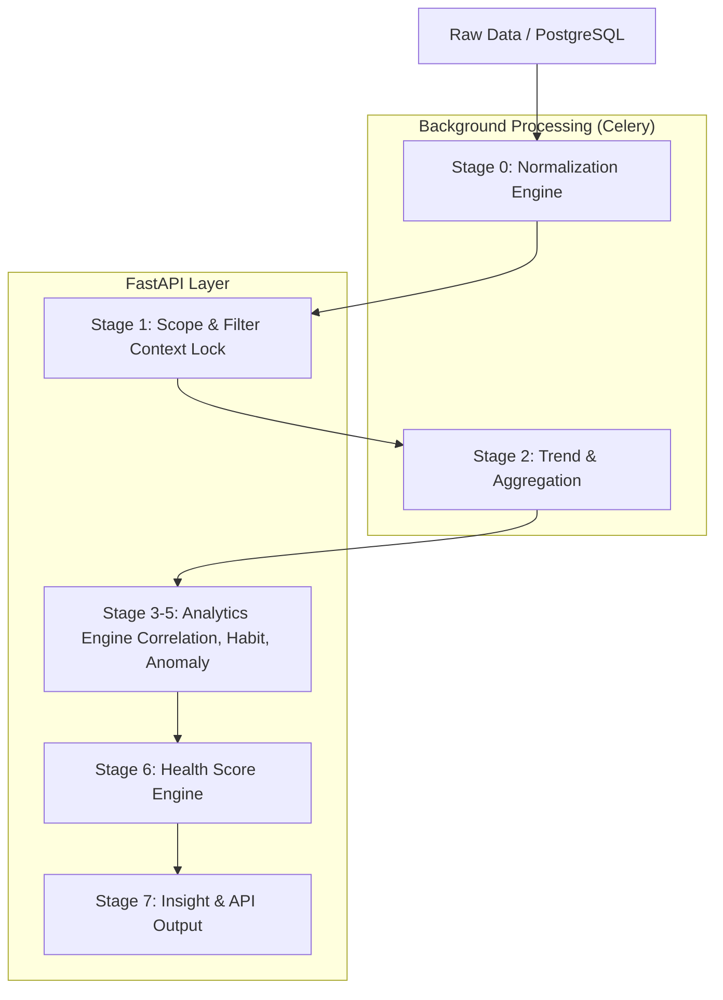

# BACKEND IMPLEMENTATION WORKFLOW: PIPELINE ANALISIS DATA V2.1
**Tanggal**: 2026-03-05
**Status**: Authoritative Implementation Guide
**Versi**: 1.0
**Referensi**: 
- [2026-03-05_assessment_backend-pipeline-v2.1.md](file:///e:/mikrotik_api/docs/analisis%20data%20v2/assessment/2026-03-05_assessment_backend-pipeline-v2.1.md)
- [Backend_Architecture_Design_V2.1.md](file:///e:/mikrotik_api/docs/analisis%20data%20v2/assessment/Backend_Architecture_Design_V2.1.md)
- [2026-03-05_audit_pipeline_v2.1.md](file:///e:/mikrotik_api/docs/analisis%20data%20v2/assessment/2026-03-05_audit_pipeline_v2.1.md)

---

## 1. PENDAHULUAN
Dokumen ini menetapkan alur kerja teknis yang sistematis untuk tim Backend dalam mengimplementasikan Pipeline Analisis Data V2.1. Fokus utama adalah pada **Data Integrity**, **High Performance**, dan **Full Traceability**.

---

## 2. DIAGRAM ALUR EKSEKUSI


---

## 3. TAHAPAN IMPLEMENTASI DETAIL

### **TAHAP 0: NORMALIZATION ENGINE (STAGE 0)**
*Fondasi Integritas Data*

1.  **Spesifikasi Teknis**:
    - Implementasi `NormalizationService` untuk klasifikasi data (MCAR, MAR, MNAR).
    - Strategi Imputasi: Forward Fill, Linear Interpolation, atau Regresi (Scipy/Pandas).
2.  **API Endpoint**:
    - `POST /api/v2/analysis/normalize`
    - **Payload**: `{ "board_id": "string", "start_time": "ISO-8601", "end_time": "ISO-8601" }`
    - **Response**: `{ "status": "success", "task_id": "uuid", "metadata": { "accuracy_pct": 98.5 } }`
3.  **Database & Relasi**:
    - Query dari tabel partitioned `board_speed_stats` & `board_resource_stats`.
    - Simpan metadata akurasi ke tabel `summary_` terkait.
4.  **Integrasi**: Celery Worker untuk memproses dataset besar secara asynchronous.
5.  **Testing**: Unit Test pada fungsi imputasi (Pytest) dengan dataset yang memiliki gap buatan.
6.  **Error Handling**: Log `NormalizationError` jika persentase gap > 50%.
7.  **Performance**: Target < 5 detik untuk dataset 1 hari (per-board).
8.  **Definition of Done (DoD)**: Data mentah berhasil diubah menjadi `NormalizedDataset` dengan metadata `accuracy_pct` yang valid.

### **TAHAP 1: CONTEXT LOCK & SCOPE (STAGE 1)**
*Isolasi Data untuk Analisis*

1.  **Spesifikasi Teknis**:
    - Penggunaan **Temporary Tables** per-session untuk mengunci scope data (start, end, granularity).
2.  **API Endpoint**:
    - Internal service call (tidak terekspos langsung ke UI).
3.  **Database**: Optimasi query menggunakan composite index `(board_id, log_time DESC)`.
4.  **Testing**: Verifikasi bahwa data yang di-lock tidak berubah meskipun ada data raw baru masuk (Snapshot Integrity).
5.  **Performance**: Query execution time < 100ms.
6.  **DoD**: Dataset berhasil di-lock dalam Temporary Table/Session Buffer.

### **TAHAP 2-5: ANALYTICS ENGINE (TREND TO ANOMALY)**
*Komputasi Statistik Berat*

1.  **Spesifikasi Teknis**:
    - `AnalysisService`: Hitung Slope, Delta, Pearson Correlation, dan Z-Score untuk deteksi anomali.
2.  **API Endpoint**:
    - `GET /api/v2/analysis/trend`
    - `GET /api/v2/analysis/anomaly`
3.  **Error Handling**: Gunakan `NaN` handling agar tidak merusak kalkulasi agregat.
4.  **Performance**: Benchmarking target 1000 RPS dengan bantuan Redis Cache (TTL 5m).
5.  **DoD**: Algoritma statistik menghasilkan output yang konsisten dengan [GLOBAL_ANALISIS_DATA.md](file:///e:/mikrotik_api/docs/analisis%20data%20v2/global/GLOBAL_ANALISIS_DATA.md).

### **TAHAP 6-7: SCORING & INSIGHT (HEALTH SCORE)**
*Output Akhir untuk Pengguna*

1.  **Spesifikasi Teknis**:
    - `HealthScoreService`: Kalkulasi bobot (Stability 30%, Utilization 30%, Anomaly 40%).
2.  **API Endpoint**:
    - `GET /api/v2/analysis/health`
    - `GET /api/v2/analysis/insight`
3.  **Response Format**:
    ```json
    {
      "health_score": 85,
      "components": { "stability": 90, "utilization": 70, "anomaly_penalty": -5 },
      "insights": ["Traffic stabil", "Utilisasi tinggi pada jam 19:00"],
      "metadata": { "trace_id": "uuid", "accuracy_pct": 98 }
    }
    ```
4.  **DoD**: Skor kesehatan dan insight deskriptif berhasil disajikan dengan metadata traceability lengkap.

---

## 4. INFRASTRUKTUR & KEAMANAN
- **Logging**: Struktur JSON terpusat dengan tag `stage_id` dan `board_id`.
- **Circuit Breaker**: Gunakan `pybreaker` pada koneksi Database dan Redis.
- **Monitoring**: Prometheus metrics untuk tracking latency per-stage.

---

## 5. KRITERIA PENERIMAAN GLOBAL (ACCEPTANCE CRITERIA)
1. Seluruh Stage 0-7 lulus Unit Test (Coverage > 80%).
2. API Response Time (p95) < 200ms pada beban 1000 RPS.
3. Data bersifat traceable 1:1 dari Insight kembali ke Raw Data Timestamp.
4. Tidak ada kebocoran memori pada Celery workers saat memproses dataset besar.

---
**Disusun Oleh**: AI Pair Programmer
**Disetujui Oleh**: Senior Backend Architect / Lead Developer
