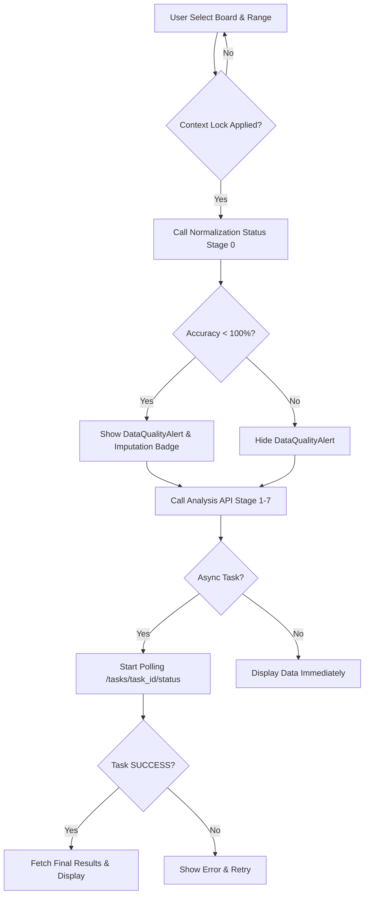

# 01: PETA ALUR INTEGRASI FRONTEND-BACKEND V2.1
**(Tanggal: 2026-03-05 | Fokus: Sinkronisasi Stage 0-7)**

## 1. PENDAHULUAN
Peta alur ini mendefinisikan interaksi antara frontend dan backend untuk memastikan data yang ditampilkan konsisten, akurat, dan transparan bagi pengguna.

---

## 2. DIAGRAM ALUR INTEGRASI (INTEGRATION FLOW)

---

## 3. PEMETAAN STAGE FRONTEND KE BACKEND

| Stage | UI Component | Backend Endpoint | Metadata Penting |
| :--- | :--- | :--- | :--- |
| **Stage 0** | `DataQualityAlert.jsx` | `/analysis/normalization/status` | `accuracy_pct`, `missing_gaps` |
| **Stage 1** | `GlobalControls.jsx` | `/analysis/scoped-dataset` | `board_id`, `start_time`, `end_time` |
| **Stage 2** | `TrendChart.jsx` | `/analysis/pipeline/execute` | `moving_averages`, `aggregates` |
| **Stage 3** | `CorrelationMatrix.jsx`| `/analysis/pipeline/execute` | `pearson_correlation` |
| **Stage 4** | `PeakHourHeatmap.jsx` | `/analysis/pipeline/execute` | `peak_hour_detection` |
| **Stage 5** | `AnomalyBadge.jsx` | `/analysis/pipeline/execute` | `z_score`, `anomalies` |
| **Stage 6** | `HealthGauge.jsx` | `/analysis/pipeline/execute` | `health_score` |
| **Stage 7** | `InsightCard.jsx` | `/analysis/pipeline/execute` | `narratives`, `recommendations` |

---

## 4. ATURAN SINKRONISASI DATA (GUIDELINES)

### **4.1 Verifikasi Stage 0 (P1)**
Berdasarkan [Audit Backend (Temuan 1)](file:///e:/mikrotik_api/docs/analisis%20data%20v2/assessment/2026-03-05_audit_backend_implementation.md#A1), Frontend **WAJIB** melakukan verifikasi status normalisasi sebelum memanggil API analisis.
- **Skenario Edge Case**: Jika data mentah belum pernah dinormalisasi untuk rentang waktu yang diminta.
- **Tindakan**: Tampilkan loading indicator "Menyiapkan Data..." dan jalankan `execute_normalization_async` jika status `PENDING`.

### **4.2 Context Locking (P0)**
Frontend harus mencegah user mengubah `board_id` atau `time_range` saat proses analisis sedang berlangsung (terutama untuk task async/celery).
- **UI Feedback**: Nonaktifkan (disable) kontrol filter selama status task backend `IN_PROGRESS` atau `STARTED`.

### **4.3 Penanganan accuracy_pct**
Setiap visualisasi yang menggunakan data dari `board_daily_summary` atau `board_monthly_summary` wajib mencantumkan label akurasi di pojok kanan atas komponen.
- **Threshold**:
    - `100%`: Label Hijau "Data Akurat".
    - `80-99%`: Label Kuning "Data Sebagian Terisi".
    - `< 80%`: Label Merah "Data Terbatas - Estimasi Saja".

---
**Referensi Backend:** [analysis_v2.py](file:///e:/mikrotik_api/backend/app/api_v2/endpoints/analysis_v2.py) | [analysis_service.py](file:///e:/mikrotik_api/backend/app/services/analysis_service.py)
